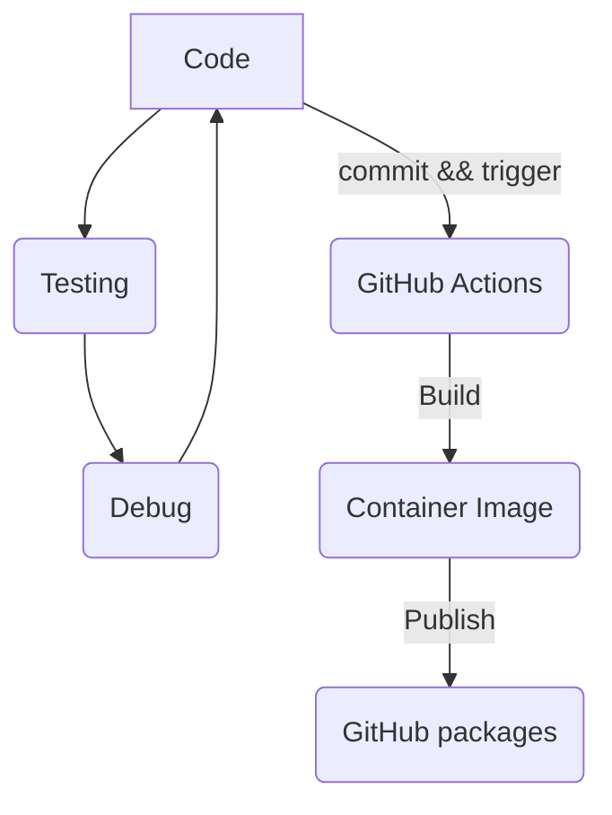

# Free Tutorial to test github packages and actions

The main purpose of this application is to test github packages and actions.
We have a simple python application that uses flask module to get time and hostname.

## Main Process



## GitHub

### GitHub Actions and Packages

GitHub Packages is a software package hosting service that allows you to host your software packages privately or publicly and use packages as dependencies in your projects.

To Learn more on GitHub Packages Documentation: [GitHub Packages](https://help.github.com/en/github/managing-packages-with-github-packages/about-github-packages)

GitHub Actions features a powerful execution environment integrated into every step of your workflow. You can discover, create, and share actions to perform any job you'd like, and combine them to customize your workflow.

To Learn more on GitHub Actions Documentation: [GitHub Actions](https://help.github.com/en/actions/automating-your-workflow-with-github-actions)

## Docker

The image built from this tutorial can be run on your own docker engine. To install docker on Windows, you can use the following link [Install Docker Windows](https://docs.docker.com/docker-for-windows/install/)
Or to install docker on Linux, you can use the following link [Install Docker Centos](https://docs.docker.com/v17.12/install/linux/docker-ce/centos/#install-docker-ce-1) or [Install Docker Ubuntu](https://docs.docker.com/v17.12/install/linux/docker-ce/ubuntu/)

After installation, you can run the container as following.
```bash
$ docker run -p 5000:5000 -d IMAGE_NAME:TAG_NAME 
```

## License

[GPL-v3.0](https://choosealicense.com/licenses/gpl-3.0/)
